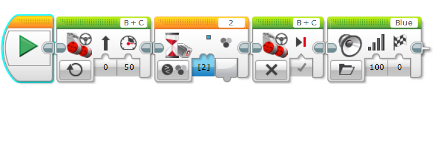

# Color sensors

Color sensors are useful for detecting if a color in front of you. It can sense up to 7 colors. It will sense the color then run the rest of the program as it was written.
Here is an example of a color sensor in action.

It will go forward until it finds the color blue. When it finds the color it will stop and say blue. 
