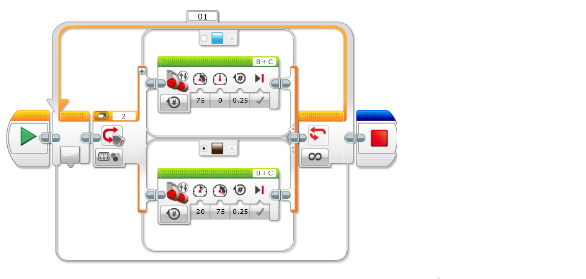

# Color sensors

Color sensors are useful for detecting if a color in front of you. It can sense up to 7 colors. It will sense the color then run the rest of the program as it was written.
Here is an example of a color sensor in action.

It will go forward until it finds the color blue. When it finds the color it will stop and say blue. 
Please watch this demonstration video.
	

## Line Follower

Line followers look super hard but the truth is they are actually very simple.

This code tells the robot to follow a line. I used a blue line. If the robot senses the color brown (My floor) it will turn right. When it senses blue (The line) it will turn left. It can sense the line if it is a zig-zag, sqaure, circle, etc.
