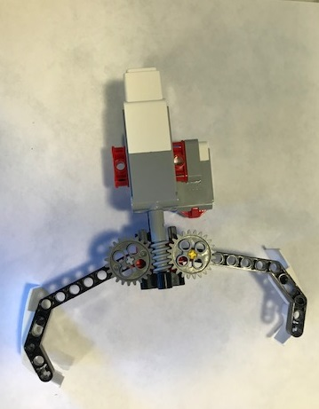
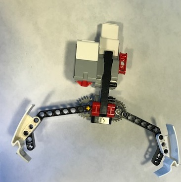
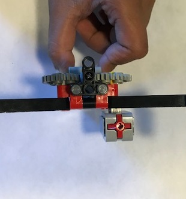
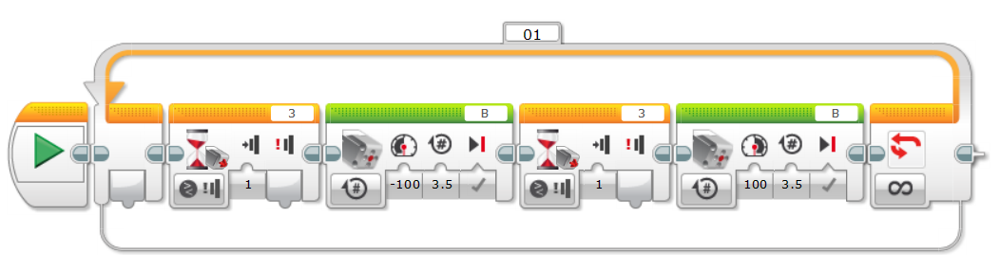

# Simple gripper
Grippers are very useful when it come to tranportation. They can move thing from one place to another. A person's hand is a gripper. Grippers usually have fingers on opposite sides.

My gripper has opposable fingers for the best grip. My gripper uses a worm gear to power both fingers in opposite direction.

Here is my code:

