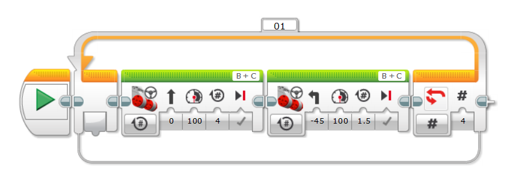
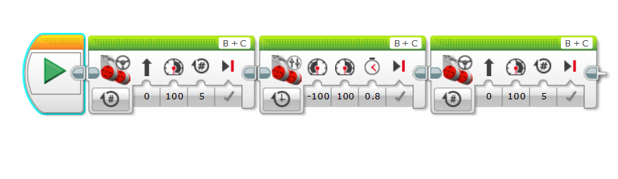
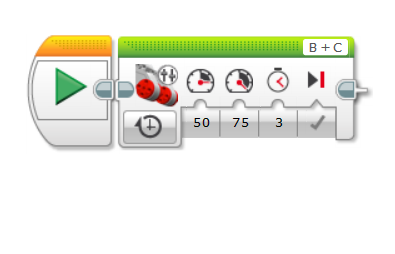

# Turning in EV3

There are three types of turning in EV3:
1. Pivot turns - in this type, one of the wheels move while the other stays put as the pivot.
2. Spin turns  - in this type, both wheels move, but in opposite directions, making it ideal for sharp turns like a 180-degree turn.
3. Smooth turns - in this type both wheel are moving in the same direction, but at different speeds. Like in a car.

## Pivot Turns
The program `Pivot turn` shows how to perform a pivot turn using any two large motored bot like the `DroidBot Jr` which I used. 

This is how it looks in action:

## Spin Turns
Spin turns are a type of turn that works well in a crammed area and is ideal for 180 degree turns.

## Smooth Turns
Smooth turns are the best type of turn. They allow both wheel to move at different speeds.

