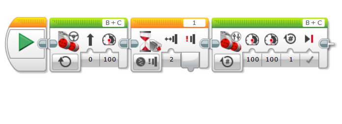

# Touch sensors

Touch sensors are useful for detecting if a thing is in front of you. It will touch it then run the rest of the program as it was written.

Please take a look at this helpful video.

	[Detecting obstacles using a touch sensor in LEGO Mindstorms EV3](https://www.youtube.com/watch?v=d6LPX05cv4w)
