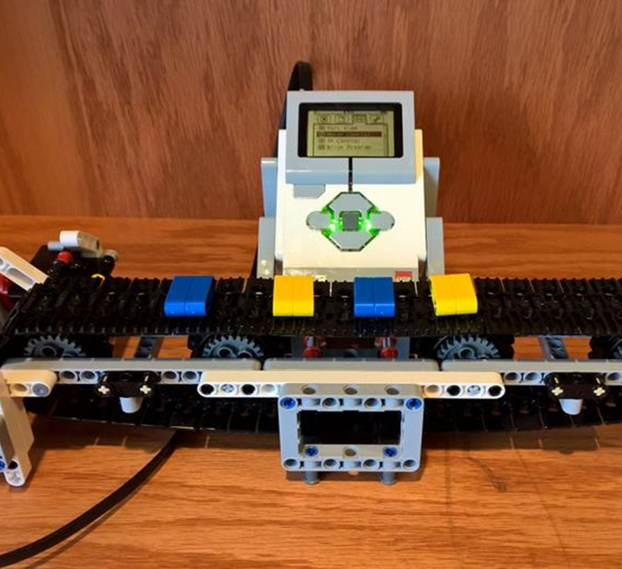

# 2020 Conveyor Belt
This project is a Lego Mindstrom project to make a conveyor belt. 

## Project plan
My aim is to make a conveyer belt that can drop things to another place. It will be built and automated by Lego Mindstorms. I am going to plan the design tomorrow. Then I will construct it a day later. Finally, will code it to run automatically. Our outcome should look something like this.

## Project process
1. I will use: 2 large motors, 1 medium motor, and touch sensor,
2. I will have the large motors power the belt, the medium motor power the end part of the belt and have the touch senor signal the start and end.
3. When I am finished, I will move on to the last part of the project. Coding. I will use what I know about coding to help me with the project.

